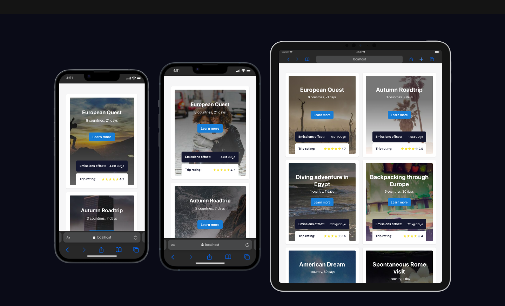

# Trip Gallery

Vite application using Bun and ChakraUI to visualize trips data.

Application is available at address: [trip-gallery](https://trip-gallery.vercel.app/)

## Technologies used:
- Vite,
- Bun,
- ChakraUI,
- Tanstack/Virtual,
- Tanstack/Router,
- react-testing-library
- jest

## Context on chosen technologies
If you are interested in why I've chosen specific libraries, you can find them in ADR folder. Example: [001-routing](./ADR/001-routing.md).

## How to run the project?
1. Clone the repository.
2. Install [bun](https://bun.sh/)
3. Run `bun install`
4. Run `bun run dev`

## How to run tests?
1. Make sure you run `bun install` before.
2. `bun run test`
3. You should get following results:
```
Test Suites: 2 passed, 2 total
Tests:       5 passed, 5 total
```

## Screenshots

### Home page




### Trip details

