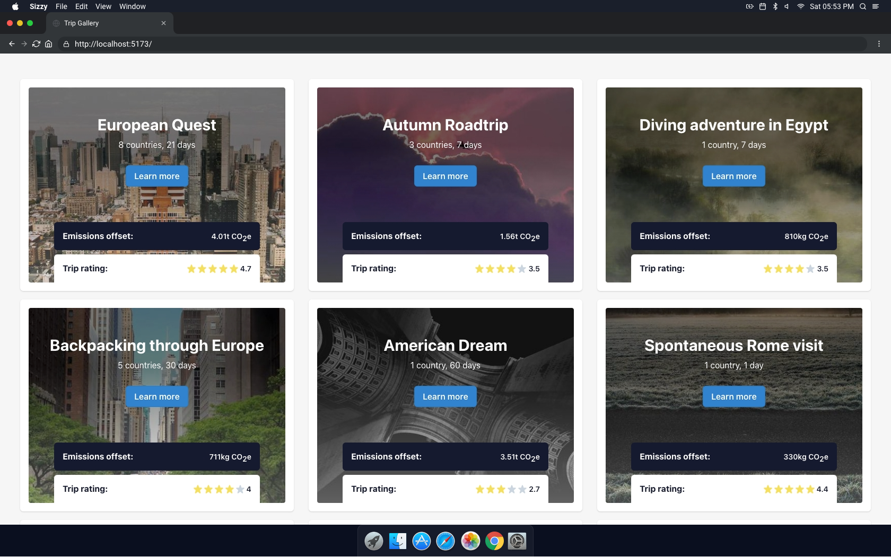
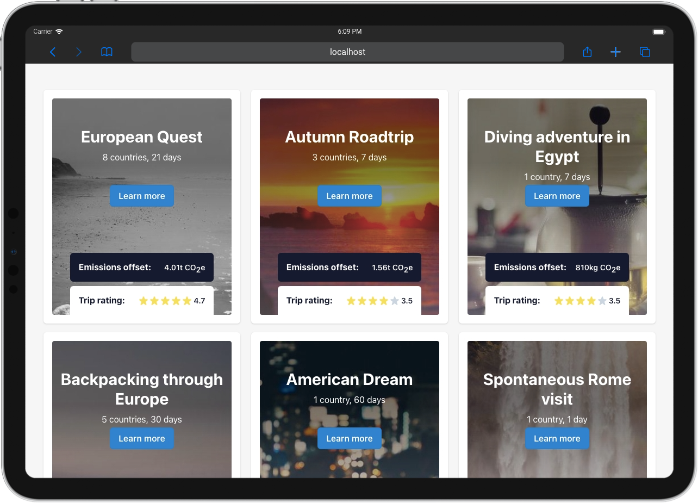
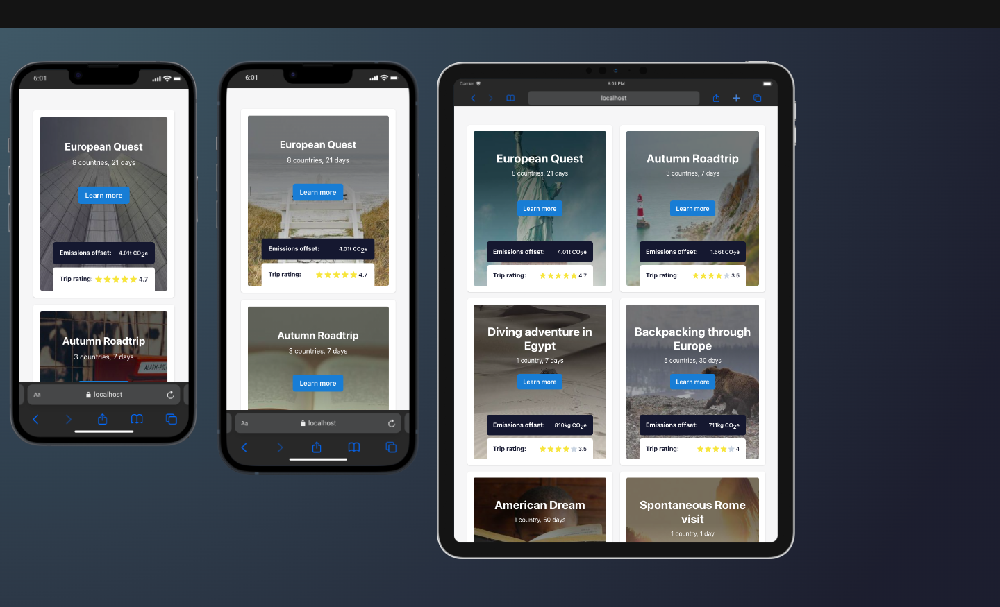
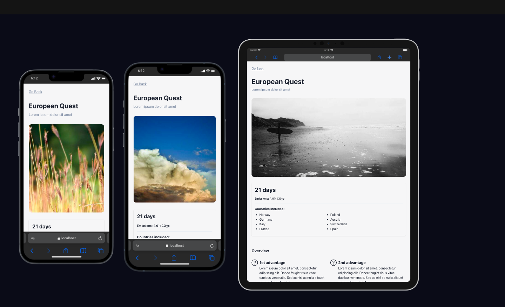
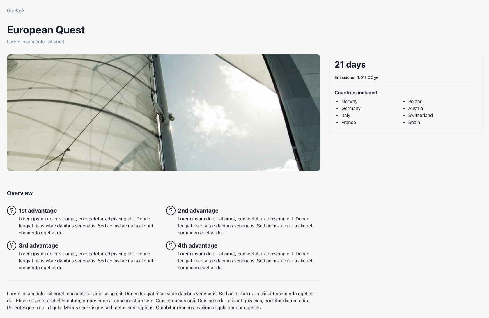

# Trip Gallery

Vite application using Bun and ChakraUI to visualize trips data.

## Technologies used:
- Vite,
- Bun,
- ChakraUI,
- Tanstack/Virtual,
- Tanstack/Router,

## How to run the project?
1. Clone the repository.
2. Install [bun](https://bun.sh/)
3. Run `bun install`
4. Run `bun run dev`

## Screenshots

### Home page

### Trip details

